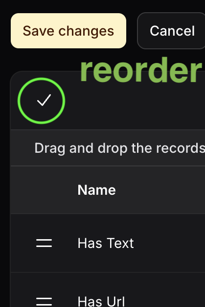
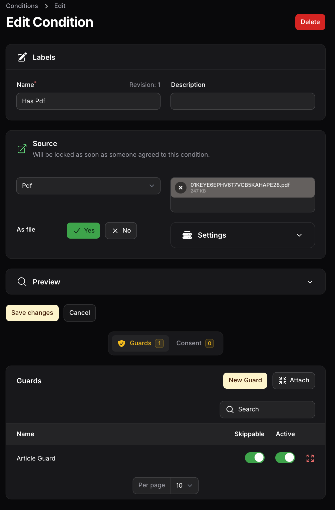
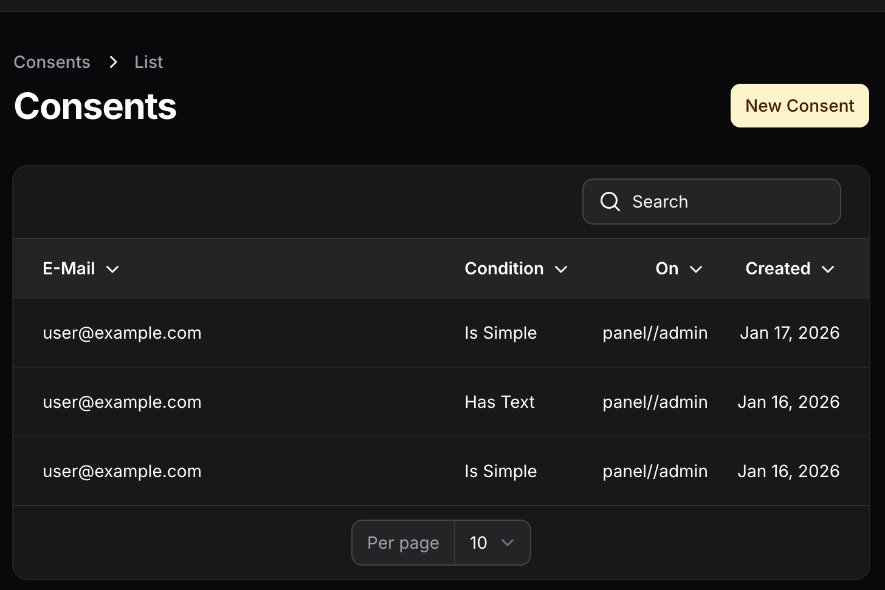
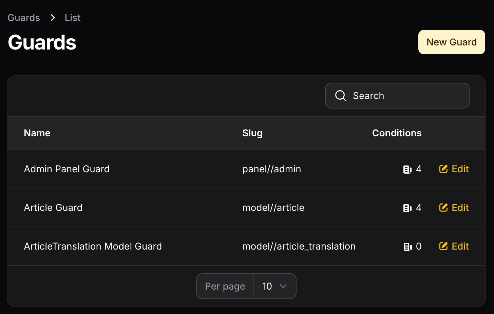
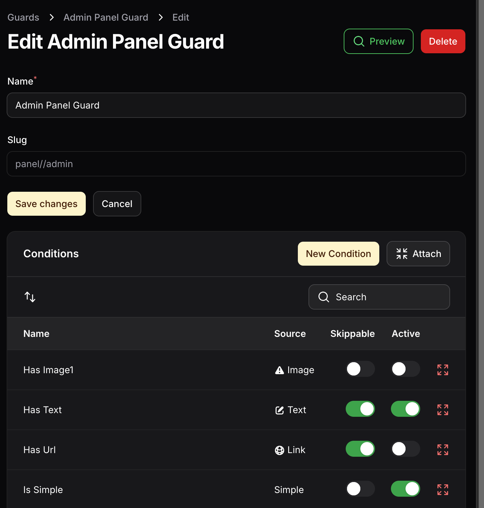
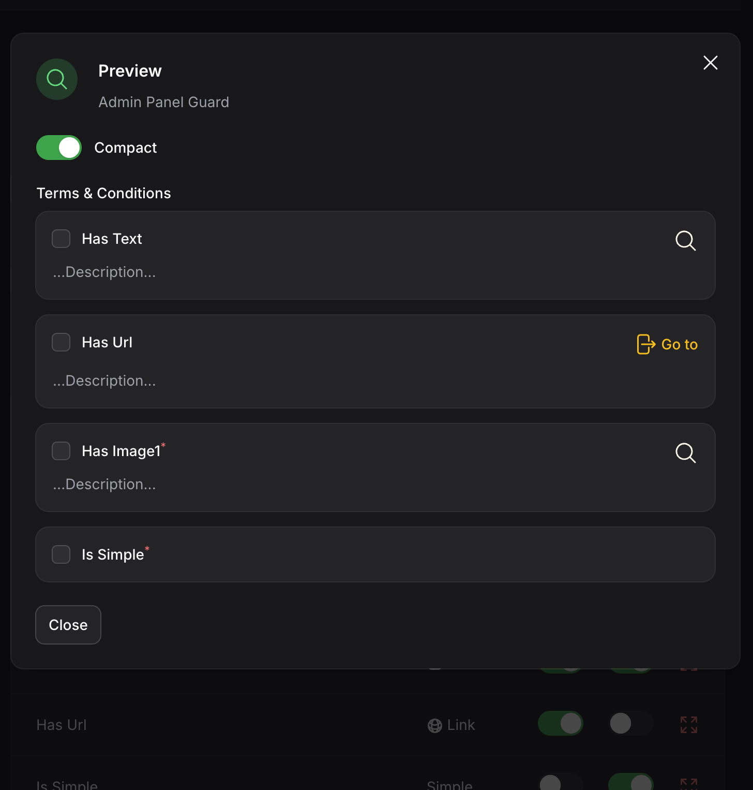

### For Filament 4.x / 5.0

# Features

- 🛡️ **Terms and Conditions Management**
    - 📦 Panel Guard
    - 📄 Model Guard
- 🔍 **Entity discovery** (panel & models)
- 🌐 **Localized**
- 🎨 **Intuitive & Responsive UI**

<div class="filament-hidden">
<b>Table of Contents</b>

- [Installation](#installation)
    - [1. Install Package](#1-install-package)
    - [2. Run Setup Command](#2-run-setup-command)
    - [3. Setup User Model](#3-setup-user-model)
    - [4. Manage Terms Plugin](#4-manage-terms-plugin)
    - [5. Terms Guard Plugin](#5-terms-guard-plugin)
    - [6. Panel Registration Form](#6-panel-registration-form)
- [Guards](#guards)
    - [Guard Features](#guard-features)
- [Panel Guard](#panel-guard)
    - [Panel Guard Usage](#panel-guard-usage)
    - [Modify Panel Slug Generation](#modify-panel-slug-generation)
- [Model Guard](#model-guard)
    - [Model Guard Setup](#model-guard-setup)
        - [HasGuardConditions Trait](#add-the-hasguardconditions-trait-to-your-order-model)
        - [ConsentComponent](#add-the-consentcomponent-to-your-form-schema)
        - [Creating A Model Guard](#add-a-model-guard-in-the-guardresource)
        - [Register Models](#register-models)
        - [Slug Creation](#hook-into-model-slug-creation)
- [Conditions](#conditions)
    - [Guards](#condition-guards)
    - [Name](#condition-name)
    - [Description](#condition-description)
    - [Slug](#condition-slug)
    - [Source](#condition-source)
    - [Source Options](#condition-source-options)
    - [Replacement](#condition-replacement)
    - [Remove Conditions](#remove-conditions)
    - [Consents](#condition-consents)
- [ConsentComponent](#consentcomponent)
    - [Visual Modes](#visual-modes)
        - [Regular](#regular-mode)
        - [Compact](#compact-mode)
    - [Layouts](#consent-component-layouts)
    - [Guards](#guards-1)
- [Consent Conditions Page Component](#consent-conditions-page-component)
    - [Slug](#slug)
    - [Filament Menu Components](#filament-menu-components)
    - [Generate Headings](#generate-headings)
    - [Component](#component)
- [Commands](#commands)
    - [Setup](#setup-command)
    - [Make Condition](#make-condition-command)
    - [Make Guard](#make-guard-command)
    - [Make Terms Model](#make-terms-model-migration)
- [Events](#events)
    - [Consent Complete](#consent-complete)
    - [Condition Consent](#condition-consent)
    - [Successor Activated](#successor-activated)
- [Disabling the Guard](#disabling-the-guard)
- [Restricting Access](#restricting-access)
- [Translations](#translations)
- [Publish Views](#publish-views)
- [TODO](#todo)
- [Credits](#credits)
- [License](#license)

</div>

# Installation

## 1. Install Package
```bash
composer require e2d2-dev/betta-terms
```

## 2. Run Setup Command
Run the setup command
   ```bash
   php artisan terms:setup
   ```

This will publish migrations, ask to publish the config file and translations

## 3. Setup User Model
To perform consent on conditions add the `HasConsents` trait to your auth provider model:

   ```php
   use Betta\Terms\Traits\User\HasConsents;

   class User extends Authenticatable
   {
       use HasConsents;
   }
   ```

## 4. Manage Terms Plugin
Add the `ManageTermsPlugin` to your panel:
   ```php
   use Betta\Terms\ManageTermsPlugin;
   
   public static function register(Panel $panel): Panel
    {
        $panel->plugins([
            ManageTermsPlugin::make(),
        ]);
   }
   ```

## 5. Terms Guard Plugin
Add the `TermsGuardPlugin` plugin to the panel you want to guard:
   ```php
   use Betta\Terms\TermsGuardPlugin;
   
    public static function register(Panel $panel): Panel
    {
        $panel->plugins([
            TermsGuardPlugin::make(),
        ]);
   }
   ```

## 6. Panel Registration Form
If you want to have the conditions on your registrations form, add the Register component to your panel.
   ```php
    use Betta\Terms\Filament\Auth\Register;
       
    public static function register(Panel $panel): Panel
    {
        $panel->registration(Register::class);
    }
   ```

# Guards
## Guard Features
#### Every guard can have multiple conditions
Conditions can be:
- skippable -> not required
- persistent -> will need consent every time / multiple times 
- orderable
  

# Panel Guard
Terms comes with a multi-panel guard. Each can have an own. 
The panel guard will be checked for new conditions every login, if there are any new users need to apply to them if not skippable.
This includes replaced conditions. 

## Panel Guard Usage
- Make sure to add the ManageTermsPlugin to your panel
- Create at least one condition
- Create a guard with the `panel` option
- Link them together

## Modify Panel Slug Generation
Hook into the Panel slug creation using:
   ```php
   use Betta\Terms\Terms;
   
    public function boot(): void
    {
        Terms::generatePanelSlugUsing(fn(string $panel) => generate_slug($panel))
    }
   ```

You can also just change the panel slug prefix in the config.
   ```php
   'config/betta-terms.php'
   
    'slug' => [
        'panel' => [
            'prefix' => 'panel//',
        ],
    ],
   ```

# Model Guard
Some records may need conditions (e.g. invoices & registrations). The model guard provides a solution for that.
Consents will be stored in the record and only committed when `commitConsent()` is called (e.g. after successful process).

## Model Guard Setup
### Add the `HasGuardConditions` trait to your order model:
   ```php
   use Betta\Terms\Traits\Model\HasGuardConditions;
   use Betta\Terms\Contracts\ModelConditions;
   
   class YourModel implements ModelConditions
   {
       use HasGuardConditions;
   }
   ```

### Add the `ConsentComponent` to your form schema:

   ```php
    use Betta\Terms\Filament\Forms\ConsentComponent;

    public function form(Schema $schema): Schema
    {
        return $schema
            ->components([
                ConsentComponent::make()
                    ->compact(),
            ]);
    }
   ```

### Add A Model Guard in the GuardResource
Add a guard in the GuardResource by selecting the type `model`. Models from App\Models namespace will be auto listed.
Add conditions to that model.

### Register Models
You can add more models to the select by registering them
   ```php
   use Betta\Terms\ManageTermsPlugin;
   
   public static function register(Panel $panel): Panel
    {
        $panel->plugins([
            ManageTermsPlugin::make()
                ->registerModel(string $model, ?string $name),
        ]);
   }
   ```

### Hook into Model Slug Creation
You can change how the slug is generated by providing a closure to Terms in a service provider:
   ```php
   use Betta\Terms\Terms;
   
    public function boot(): void
    {
        Terms::generateModelSlugUsing(fn(string $class) => generate_slug($class))
    }
   ```

You can also just change the model slug prefix in the config.
   ```php
   'config/betta-terms.php'
   
    'slug' => [
        'model' => [
            'prefix' => 'model//',
        ],
    ],
   ```

# Conditions

## Condition Guards
- Every Condition can be added to any guard.
- Conditions can be marked active or skippable in each guard separately
- Conditions can be activated as soon as they have data filled in

## Condition Name
The name is required. It will show up to the client. 
It is visible as the checkbox label in the compact mode and as section heading in the full mode

## Condition Description
Description is not required but can be a useful info for clients for further context. 
It will show up in compact mode below the `accepted` checkbox and as description in full mode.

## Condition Slug
The slug is autogenerated with timestamp as prefix and with revision suffix.

## Condition Source
Every condition has its own content which can be supplied as
- text (url+markdown)
- file (with upload)
- as url
or just the name for small consents. 

## Condition Source Options
- PDF
- Link
- Text
- Markdown
- Iframe
- Simple
- Image

## Condition Replacement
When a condition needs improvement, you can't just edit the file, because it is an official document.
Hit the replace action in the ConditionResource to replace it. As soon as all required data is filled in, 
you will be asked to replace the predecessor (previous version).
The Predecessor will be removed from all guards and replaced by the successor.

## Remove Conditions
A Condition can only be deleted when they have any consents yet.

## Condition Consents
Every user's consent will be stored. On which guard or component it was signed will also be stored in the `signed_on` column of the consent table

# ConsentComponent
## Visual Modes
The consent component has two visual modes: regular and compact. 
Regular mode is of bigger size for full-page usage. Compact mode for in-form usage.

### Regular Mode

### Compact Mode
Every condition is presented with the `AcceptedCheckbox` which has the condition name as label, description as hint and
a view action to display the content if applicable.

   ```php
    use Betta\Terms\Filament\Forms\ConsentComponent;

        ConsentComponent::make()
            ->compact(),
   ```

### Consent Component Layouts
The component does support further layouts:
   ```php
    use Betta\Terms\Filament\Forms\ConsentComponent;

        ConsentComponent::make()
            ->aside()
            ->asSection(),
   ```
## Guards
The consent component will find its guards automagically, but you can also specify the guard by slug or by model

   ```php
    use Betta\Terms\Filament\Forms\ConsentComponent;

        ConsentComponent::make()
            ->guard($model)
            ->guard('guard-slug'),
   ```

# Consent Conditions Page Component
This page will be shown when there are open conditions a user needs to consent. 

## Slug
The slug can be customized through the config
   ```php
   'page' => [
        'consent_conditions' => [
            'slug' => 'consent-conditions',
        ],
    ]       
   ```

## Filament Menu Components
Can be individually enabled/disabled 
   ```php
   'page' => [
        'consent_conditions' => [
            'topbar' => true,
            'global_search' => false,
            'navigation' => false,
         ],
    ]       
   ```

## Generate Headings
You can define the heading by adding a closure `TermsGuardPlugin::generateConsentConditionsHeadingUsing()`
The parameters $livewire, $guard, $user & $panel will be provided;

   ```php
   use Betta\Terms\TermsGuardPlugin;
   
    public static function register(Panel $panel): Panel
    {
        $panel->plugins([
            TermsGuardPlugin::make()->generateConsentConditionsHeadingUsing(fn($livewire, $guard, $user, $panel) => 'Your Heading'),
        ]);
   }
   ```

## Component
The component can be swapped.
   ```php
   'page' => [
        'consent_conditions' => [
            'component' => YourPageComponent::class,
         ],
    ]       
   ```

# Commands
## Setup Command
Will check if
- the filament plugins are registered to any panel and provide information how to add them
- tables are migrated and will ask to publish&run the migrations
- config is published and ask to publish
- translation is published and ask to publish
- 
```bash
php artisan terms:setup
```

## Make Condition Command
Create a condition and attach it to a guard. You will still need to visit the condition management resource. Link will be provided by the command after creation.

```bash
php artisan make:terms-condition
```

## Make Guard Command
Create a guard. You will still need to visit the guard management resource. Link will be provided by the command after creation.
```bash
php artisan make:terms-guard
```

## Make Terms Model Migration


# Events
Terms supplies events if you want to attach further actions after something happened.

## Consent Complete
Will dispatch after ConsentConsentConditions is completed

   ```php
    use Betta\Terms\Events\ConsentComplete;
   
    public function __construct(
        User $user, 
        ?string $signedOn = null, 
        ?Guard $guard = null
    )

   ```

## Condition Consent
After a condition was accepted.
```php
    use Betta\Terms\Events\ConditionConsent;
    use Betta\Terms\Models\Consent;
    use Betta\Terms\Models\Condition;
    
    public function __construct(Consent $consent)
    {
        /** @var User $user */
        $user = $consent->user;
        
        /** @var Condition $condition */
        $condition = $consent->condition;
        
        /** @var string $signedOn */
        $signedOn = $consent->signed_on;
        
        /** @var \Carbon\CarbonInterface $createdAt */
        $createdAt = $consent->created_at;
    }

```

## Successor Activated
When a new condition was activated and the predecessor got obsolete

```php
    use Betta\Terms\Events\Condition\SuccessorActivated;
    use Betta\Terms\Models\Condition;
    
    /** @param Condition $condition */
    public function __construct($condition)
    {
        $predecessor = $condition->predecessor;
    }

```


# Disabling the guard
If you need to disable the panel guard for some reason or for some user, provide a closure or a just bool to:
   ```php
use Betta\Terms\TermsManager;
use Betta\Terms\Models\Guard;
use Filament\Panel;

        Terms::disableGuard(
            fn(
                TermsManager $manager, 
                User $user, 
                Guard $panelGuard, 
                Panel $panel
            ) : bool => $user->isSuperAdmin(), 
        )
   ```

# Restricting Access
Terms does not come with permission configuration on purpose. You can enable/disable every Filament Resource/Action through policies as permissions are handled different in every app.
Example:

   ```php

class ConditionPolicy
{
    public function viewAny(User $user): Response | bool
    {
        return ! $user->isSuperAdmin(); // will disable the ConditionResource for everyone except "superAdmins"
    }
}

   ```

There is one custom Action: Condition "ReplaceAction" which will forward to the model action:
   ```php

class Condition extends Model
{
    public function replace(): Condition
    {
        return Replace::run($this);
    }
}

// corresponding policy function
class ConditionPolicy
{
    public function replace(User $user, Condition $record): Response | bool
    {
        return $user->can('replace'); // e.g.
    }
}

   ```

# Translations
Localization is available in: [ en, de, es, fr & pt ] at the moment.

Publish the translations using:

```bash
php artisan terms:setup
```
or via the service provider:
```bash
    php artisan vendor:publish --provider="Betta\Terms\ServiceProvider" --tag=translations

```
# Publish Views
```bash
    php artisan vendor:publish --provider="Betta\Terms\ServiceProvider" --tag=views

```

# Screenshots








# TODO
- Disabling Sources & Components
- Conditions with language / country separation

# Credits

- [Filament Team](https://www.filamentphp.com)

# License

The MIT License (MIT). Please see [License File](LICENSE.md) for more information.
